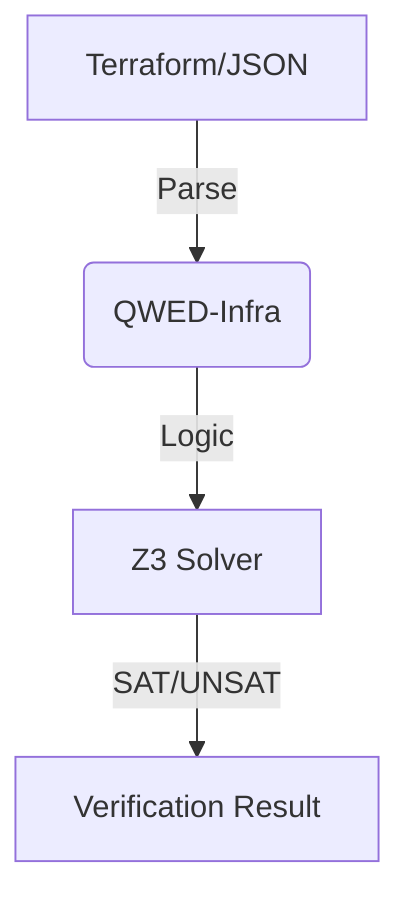

# qwed-infra
<<<<<<< HEAD

**Deterministic Verification for Infrastructure as Code (IaC)**

`qwed-infra` is a Python library that uses **Formal Methods (Z3 Solver)** and **Graph Theory** to mathematically prove the security and compliance of detailed infrastructure definitions (Terraform, AWS IAM, Kubernetes).

It is part of the [QWED Ecosystem](https://github.com/QWED-AI).

## 🚀 Features

### 1. 🛡️ IamGuard (Implemented)
Verifies AWS IAM Policies using the **Z3 Theorem Prover**.
Instead of regex matching, it converts policies into logical formulas to prove reachability.

- **Wildcard Support:** Handles `s3:*`, `arn:aws:s3:::bucket/*` correctly.
- **Deny Overrides:** Proves that explicit Deny statements always override Allows.
- **Least Privilege:** Mathematically proves if a policy allows stronger permissions than intended.

### 2. 🌐 NetworkGuard (Implemented)
Verifies Network Reachability using Graph Theory.
- "Can the Public Internet reach the Database Subnet on Port 5432?" -> **False** (Proven by Graph Traversal).
- **Public Access:** Checks Routes (IGW) + Security Group Ingress (0.0.0.0/0).

### 3. 💰 CostGuard (Planned)
Deterministic Cloud Cost estimation before deployment.
- Prevents AI Agents from provisioning expensive instances (e.g., `p4d.24xlarge`) without approval.

## 📦 Installation
...
### Verifying Network Reachability

```python
from qwed_infra import NetworkGuard

net_guard = NetworkGuard()

# A mock infrastructure definition (simplified)
infra = {
    "subnets": [
        {"id": "subnet-public", "security_groups": ["sg-web"]},
        {"id": "subnet-private", "security_groups": ["sg-db"]}
    ],
    "route_tables": [
        {
            "subnet_id": "subnet-public", 
            "routes": {"0.0.0.0/0": "igw-main"} # Route to Internet
        },
        {
            "subnet_id": "subnet-private", 
            "routes": {} # No routes out
        }
    ],
    "security_groups": {
        "sg-web": {"ingress": [{"port": 80, "cidr": "0.0.0.0/0"}]},
        "sg-db":  {"ingress": [{"port": 5432, "cidr": "10.0.0.0/16"}]}
    }
}

# 1. Check Public Web Access
res = net_guard.verify_reachability(infra, "internet", "subnet-public", 80)
print(f"Web Accessible? {res.reachable}") # -> True

# 2. Check Database Exposure
res = net_guard.verify_reachability(infra, "internet", "subnet-private", 5432)
print(f"DB Exposed? {res.reachable}") # -> False (No Route)
```

```bash
pip install qwed-infra
```

## ⚡ Usage

### Verifying IAM Policies

```python
from qwed_infra import IamGuard

guard = IamGuard()

# A risky policy?
policy = {
    "Version": "2012-10-17",
    "Statement": [
        {"Effect": "Allow", "Action": "s3:*", "Resource": "arn:aws:s3:::prod-data/*"},
        {"Effect": "Deny",  "Action": "s3:DeleteBucket", "Resource": "*"}
    ]
}

# 1. Check specific access
result = guard.verify_access(
    policy, 
    action="s3:GetObject", 
    resource="arn:aws:s3:::prod-data/financials.csv"
)
print(f"Can access? {result.allowed}") # -> True

# 2. Check forbidden action (overridden by Deny)
result = guard.verify_access(
    policy, 
    action="s3:DeleteBucket", 
    resource="arn:aws:s3:::prod-data"
)
print(f"Can delete bucket? {result.allowed}") # -> False (Correctly Denied)

# 3. Verify Least Privilege (Admin check)
result = guard.verify_least_privilege(policy)
print(f"Is Admin? {result.allowed}") # -> False (Safe)
```

## 🏗️ Architecture



## 🤝 Contributing

We welcome contributions! Please see `CONTRIBUTING.md`.

## 📄 License

Apache 2.0
=======
Deterministic Verification for Infrastructure as Code (IaC). Prove security of Terraform, Kubernetes, and AWS IAM policies using Z3 Solvers and Graph Theory to prevent misconfiguration and cost overruns.
>>>>>>> 42fb586ba3ca93303bcd89d1ebe494ab36ce184c
